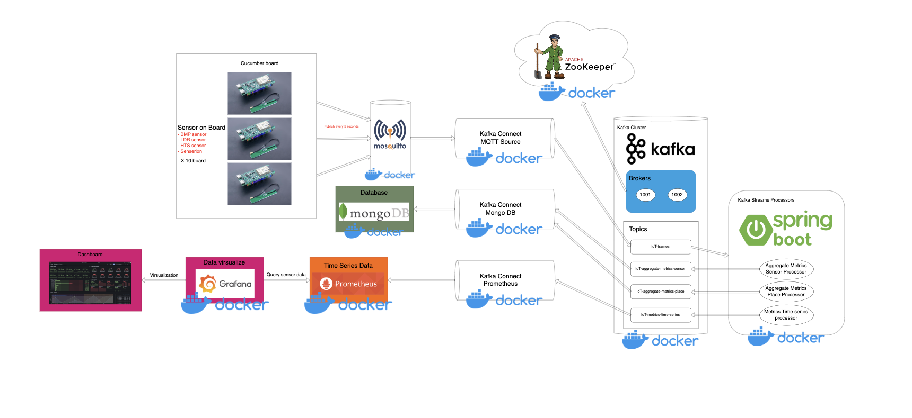

# Main technologies of architecture

## Architecture Overview

## Eclipse Mosquitto

**Eclipse Mosquitto** เป็นซอฟต์แวร์โอเพ่นซอร์สที่ทำหน้าที่เป็น MQTT broker ซึ่งเป็นโปรโตคอลที่ใช้ในการสื่อสารระหว่างอุปกรณ์ IoT ด้วยการออกแบบที่มีประสิทธิภาพและใช้ทรัพยากรน้อย ทำให้ Eclipse Mosquitto เหมาะสำหรับงานที่เกี่ยวกับ IoT โดยมีคุณสมบัติหลักดังนี้
- **โอเพ่นซอร์ส** ดาวน์โหลดและใช้งานได้ฟรี รวมถึงแก้ไขซอฟต์แวร์ได้ตามต้องการ
- **รองรับ MQTT** ทำหน้าที่เป็นตัวกลางในการส่งและรับข้อความระหว่างอุปกรณ์
- **ติดตั้งง่าย** รองรับหลายระบบปฏิบัติการ เช่น Windows, macOS, และ Linux
- **ความปลอดภัย** รองรับการเข้ารหัส SSL/TLS และการตรวจสอบสิทธิ์ของผู้ใช้

## Apache ZooKeeper

**Apache Zookeeper** เป็นระบบจัดการและประสานงานแบบกระจาย (distributed coordination service) โดยใช้ในระบบที่มีความซับซ้อนและต้องการความเสถียรสูง เช่น Apache Kafka, Hadoop, และ Hbase 

หน้าที่และคุณสมบัติสำคัญของ ZooKeeper ได้แก่
- จัดการ brokers และบันทึกสถานะของ brokers แต่ละตัว
- บันทึกข้อมูลเกี่ยวกับ topics และ partitions
- เลือก leader/replica ของ partitions
- แจ้งเตือน Kafka เมื่อมีการเปลี่ยนแปลง เช่น broker ใหม่หรือตาย
- บันทึกการเขียน/อ่านข้อมูลของ producers และ consumers
- เก็บข้อมูล Authorization สำหรับการสร้าง topics
- ติดตาม offset ของ consumer groups

## Apache Kafka

**Apache Kafka** เป็นแพลตฟอร์มสำหรับการส่งผ่านข้อมูลแบบกระจาย (distributed data transmission platform) ที่สามารถจัดการข้อมูลจำนวนมากได้ในแบบเรียลไทม์ (real-time) โดย Kafka สามารถเผยแพร่ (publish) ข้อมูลจากแหล่งต่างๆ ไปยังหลายปลายทาง, เก็บ ข้อมูลไว้สำหรับการประมวลผลในอนาคต, ประมวลผล ข้อมูลที่ไหลผ่านในทันที และ สมัครรับข้อมูล (subscribe) เพื่อดึงข้อมูลนั้นๆ ไปใช้งานโดยผู้บริโภค (consumers) ที่สนใจ

Kafka มีความสามารถในการจัดการสตรีมข้อมูลได้จากแหล่งข้อมูลหลายที่ และสามารถกระจายข้อมูลไปยังหลายปลายทางพร้อมกันได้ ซึ่งทำให้ Kafka เหมาะสำหรับงานที่ต้องการการรับส่งข้อมูลจำนวนมหาศาลจากแหล่งข้อมูลหลายๆ จุดไปยังผู้ใช้หรือระบบต่างๆ ที่ต้องการข้อมูลเหล่านั้นในเวลาเดียวกัน

หลักการทำงานของ Kafka
- Producer  คือระบบหรือแอปพลิเคชันที่สร้างข้อมูลและส่งข้อมูลเหล่านั้นไปยัง Kafka เช่น แอปพลิเคชันที่บันทึกการใช้งานของผู้ใช้ในเว็บไซต์ ข้อมูลนั้นจะถูกส่งเข้าไปที่หัวข้อ (topics) ใน Kafka
- Topic ข้อมูลทุกอย่างที่ส่งมาจะถูกจัดเก็บในหัวข้อ ซึ่งเป็นเหมือน “ที่อยู่” สำหรับข้อมูลประเภทหนึ่งๆ ตัวอย่างเช่น มีหัวข้อสำหรับบันทึกข้อมูลการเข้าชมเว็บไซต์ของผู้ใช้ และอีกหัวข้อหนึ่งสำหรับบันทึกคำสั่งซื้อสินค้า
- Consumer ระบบหรือแอปพลิเคชันที่ดึงข้อมูลจากหัวข้อใน Kafka เช่น แอปพลิเคชันวิเคราะห์ข้อมูลที่ดึงข้อมูลการเข้าชมเว็บไซต์จากหัวข้อที่เกี่ยวข้อง และประมวลผลข้อมูลนั้น
- Broker  ทำหน้าที่เป็นตัวเก็บข้อมูล โดยเมื่อ producer ส่งข้อมูลมา ข้อมูลเหล่านั้นจะถูกบันทึกและจัดเก็บแบบกระจายไปยังหลายตัวกลาง (brokers) เพื่อให้สามารถรองรับการประมวลผลได้มากขึ้นและปลอดภัยจากการสูญหายของข้อมูล

## Apache Kafka Connect

**Kafka Connect** เป็นเครื่องมือที่ทำหน้าที่เชื่อมต่อและแปลงข้อมูลระหว่างระบบต้นทาง (source systems) และระบบปลายทาง (target systems) โดยไม่ต้องสร้าง producer และ consumer ขึ้นมาเอง Kafka Connect ช่วยลดความซับซ้อนในการทำงานกับข้อมูลจำนวนมากที่อยู่ใน Kafka

## Apache Kafka Streams

**Kafka Streams** เป็นไลบรารีที่พัฒนาเพิ่มเติมจาก Kafka ที่ช่วยให้สามารถประมวลผลข้อมูลที่ไหลผ่าน Kafka ได้ในรูปแบบของสตรีม (stream processing) หรือการประมวลผลข้อมูลแบบต่อเนื่อง โดย Kafka Streams ช่วยให้นักพัฒนาสามารถเขียนแอปพลิเคชันที่สามารถรับข้อมูลจาก Kafka มาแปลงข้อมูล วิเคราะห์ และส่งผลลัพธ์กลับไปยัง Kafka หรือระบบอื่นๆ ได้อย่างมีประสิทธิภาพ

หลักการทำงานของ Kafka Streams

Kafka Streams ทำงานโดยใช้ข้อมูลที่อยู่ในหัวข้อ (topics) ของ Kafka แล้วทำการประมวลผลผ่านฟังก์ชันต่างๆ เช่น การกรองข้อมูล การรวมข้อมูล หรือการคำนวณ จากนั้นสามารถส่งผลลัพธ์ที่ได้กลับไปยัง Kafka หรือนำไปใช้ในแอปพลิเคชันอื่นๆ

- Source ข้อมูลที่ Kafka Streams นำมาใช้งานนั้นมาจากหัวข้อ (topics) ที่ถูกสร้างไว้ใน Kafka โดย Kafka Streams จะทำการดึงข้อมูล จากหัวข้อเหล่านั้นและเริ่มการประมวลผล
- Stream Processing ข้อมูลที่ดึงเข้ามาจะถูกประมวลผลในรูปแบบของสตรีม ซึ่งเป็นการประมวลผลแบบต่อเนื่องและสามารถใช้ฟังก์ชันต่างๆ เพื่อเปลี่ยนแปลงหรือวิเคราะห์ข้อมูล เช่น การกรองข้อมูลที่ไม่ต้องการ การรวมข้อมูลจากหัวข้ออื่น หรือการคำนวณค่าเฉลี่ย
- Sink  ผลลัพธ์ที่ได้จากการประมวลผลข้อมูลจะถูกส่งออกไปยังหัวข้อใน Kafka หรือนำไปใช้ในระบบภายนอกอื่นๆ เช่น ระบบฐานข้อมูลหรือแดชบอร์ดแสดงผล

ประมวลผลข้อมูลจากเซ็นเซอร์ที่ส่งผ่าน Kafka topic ได้แก่
1. Aggregate Metrics By Sensor Processor 
2. Aggregate Metrics By Place Processor 
3. Aggregate Metrics Time Series Processor

## Apache Kafka Rest Proxy

**Kafka REST Proxy** เป็นเครื่องมือหรืออินเทอร์เฟซที่ช่วยให้ผู้ใช้สามารถสื่อสารกับ Kafka brokers ผ่าน HTTP API แทนที่จะใช้ Kafka client โดยตรง ซึ่งทำให้การเชื่อมต่อกับ Kafka ง่ายขึ้นสำหรับแอปพลิเคชันหรือบริการที่ไม่รองรับ Kafka client libraries หรือไม่ได้เขียนด้วยภาษาที่ Kafka รองรับโดยตรง
## Prometheus

**Prometheus** เป็นระบบมอนิเตอร์ริ่งและเตือนภัยแบบโอเพ่นซอร์สที่ออกแบบมาเพื่อรวบรวมและจัดเก็บข้อมูลเมตริกในรูปแบบ time series data เหมาะสำหรับการมอนิเตอร์ระบบและแอปพลิเคชันต่าง ๆ โดยมีการทำงานแบบกระจายและมีความยืดหยุ่นสูง Prometheus สามารถทำงานร่วมกับ Grafana เพื่อสร้างกราฟแสดงข้อมูลแบบเรียลไทม์

## MongoDB

**MongoDB** ทำหน้าที่เป็นที่เก็บข้อมูลแบบเรียลไทม์จาก Kafka ซึ่งข้อมูลที่มาจากอุปกรณ์ IoT หรือเซนเซอร์จะถูกส่งเข้ามาอย่างต่อเนื่องและจัดเก็บใน MongoDB โดยสามารถรวบรวมข้อมูลจากเซนเซอร์แต่ละตัว เช่น ข้อมูลอุณหภูมิหรือค่าที่วัดได้จากเซนเซอร์ในช่วงเวลาที่กำหนด MongoDB สามารถจัดเก็บและสรุปข้อมูลที่รวบรวมมาจากเซนเซอร์หลายตัวในสถานที่เดียวกัน เช่น ข้อมูลของห้องหรือชั้นของอาคาร และยังรองรับการขยายขนาดได้ดี ทำให้สามารถจัดเก็บข้อมูล IoT ปริมาณมากจากเซนเซอร์หลายตัวโดยไม่ลดประสิทธิภาพ

## Grafana

**Grafana** เป็นเครื่องมือสร้างแดชบอร์ดที่สามารถแสดงข้อมูลจากเมตริกต่าง ๆ ในรูปแบบกราฟแบบเรียลไทม์ Grafana รองรับการดึงข้อมูลจากแหล่งข้อมูลยอดนิยม เช่น Prometheus, InfluxDB, Elasticsearch, AWS CloudWatch เป็นต้น 

จุดเด่นของ Grafana คือ
- **การมอนิเตอร์เมตริกแบบเรียลไทม์** สามารถดู CPU, Memory และเมตริกอื่น ๆ ได้ทันที
- **การแจ้งเตือน** รองรับการแจ้งเตือนผ่าน Email, Slack, Line และช่องทางอื่น ๆ
- **ความยืดหยุ่นสูง** มีตัวเลือกในการปรับแต่งกราฟและแผงควบคุม (panels) อย่างหลากหลาย
- **รองรับหลาย Data Sources** สามารถใช้งานกับแหล่งข้อมูลหลายประเภทพร้อมกันได้

## IoT Processor

**IoT Processor** เป็นการประมวลผลข้อมูลที่ได้จากเซ็นเซอร์ ข้อมูลที่เก็บมาอาจจะถูกส่งไปยังระบบประมวลผลหรือเซิร์ฟเวอร์กลาง การประมวลผลอาจรวมถึง

- การคำนวณ: เช่นการคำนวณค่าเฉลี่ย หรือค่าความผันแปรของข้อมูล
- การแปลงข้อมูล: เช่น การแปลงหน่วยข้อมูลที่ได้จากเซ็นเซอร์
- การจัดส่งข้อมูล: ส่งข้อมูลไปยัง MQTT broker เพื่อนำไปแสดงผลบน Grafana หรือเก็บในฐานข้อมูล
## IoT Sensor
ในโปรเจคนี้เรามี IoT Sensor 2 รูปแบบคือ 
* ข้อมูล IoT Sensor จาก hardware (Cucumber)
* ข้อมูล IoT Sensor จาก ไมโครเซอร์วิส ที่จำลองจาก Container 
### Cucumber  
IoT Sensor เป็นโมดูลเซ็นเซอร์หรือฟังก์ชันที่เกี่ยวกับการรวบรวมข้อมูลจากเซ็นเซอร์ต่างๆบนอุปกรณ์ hardware รวมถึงการอ่านค่าในระบบ IoT ตัวอย่างเช่น

- อุณหภูมิ: การรวบรวมอุณหภูมิจากเซ็นเซอร์อุณหภูมิ เช่น DHT11, BMP280
- ความชื้น: การเก็บค่าความชื้นในอากาศ
- แสง: การเก็บข้อมูลความเข้มของแสงจาก LDR ที่ทำการต่อเพิ่ม(cucumberไม่มีbuilt-in)
- ความกดอากาศ: atm

### IoT Sensor container
IoT Sensor เป็น sensor ที่ถูกจําลองด้วยไมโครเซอร์วิสที่ใช้ใน Spring Boot (ผ่านไลบรารี Eclipse Paho MQTT) ที่ถูกติดตั้งอยู่บนเซิฟเวอร์ โดยจะส่งข้อมูล telemetry ไปยังโบรกเกอร์ Eclipse Mosquitto ข้อมูลที่ถูกจำลองนี้ generate ค่า ทุกอย่างภายใน payload มาจาก Callable โดยจะถูกสร้างขึ้นทุกวินาทีและ มี payload ในรูปแบบที่สร้างขึ้นให้ตรงกัน

