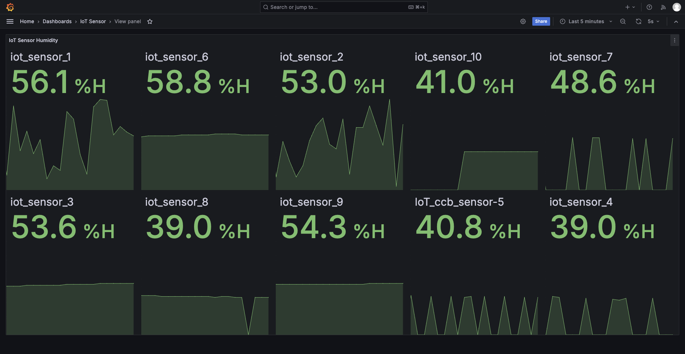
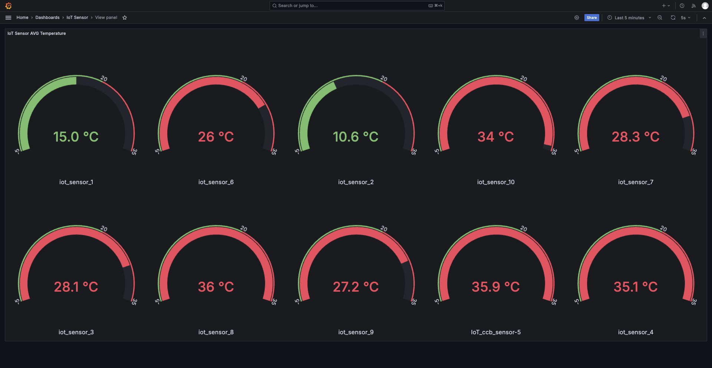
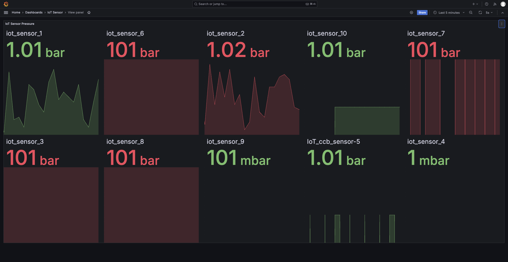
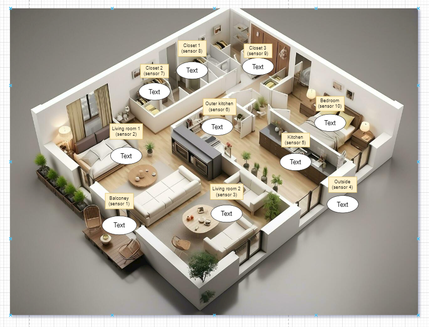

# Data Visualization.

<!-- >> นำข้อมูลอะไรมาแสดงในส่วนของ Visualization บ้าง -->

การสร้าง Dashboard สำหรับ Visualization โดยใช้ Grafana และ FlowCharting คือการนำข้อมูลจากเซ็นเซอร์มาวิเคราะห์และแสดงผลในรูปแบบแผนผังสถานที่ผ่าน FlowCharting ซึ่งเป็น Plugin ของ Grafana ที่ช่วยให้ผู้ใช้สามารถสร้างและปรับแต่งแผนผัง (Flowchart) เพื่อแสดงสถานะหรือข้อมูลต่างๆ ให้สามารถเข้าใจง่าย สำหรับการสร้างแผนผังสถานที่ที่ต้องการ ผู้ใช้สามารถสร้างแผนผังนั้นใน Draw.io ซึ่งเป็นเครื่องมือสำหรับการออกแบบ Diagram จากนั้นนำแผนผังที่สร้างเสร็จแล้วมาใช้ใน Grafana ผ่าน FlowCharting Plugin เพื่อเชื่อมต่อกับข้อมูลเซ็นเซอร์ แล้วนำมา แสดงผลข้อมูลลงบน Dashboard ซึ่งจะช่วยให้ผู้ใช้สามารถติดตามสถานะและข้อมูลต่างๆของแต่ละ sensor ได้อย่างมีประสิทธิภาพและเข้าใจง่าย

## งานที่ได้ทำ
จากงานได้ใช้เซ็นเซอร์ทั้งหมด 10 ตัว เพื่อมาแสดงข้อมูล อุณหภูมิ (Temperature), ความชื้น (Humidity), ความสว่าง (Luminosity), และ ความดัน (Pressure) โดยมีทั้งรูปแบบ Guage, Stat และ Graph และยังสามารถเก็บข้อมูลเป็น time series data บน Prometeus ได้อีกด้วย 


### Humidity


เหตุผลที่ได้เลือกใช้เป็น Stat Chart ในการแสดงค่า Humidity

เนื่องจาก:

1. Stat Chart แสดงข้อมูลที่ชัดเจนและทันที แสดงค่าเดียวที่สำคัญ เช่น ค่าปัจจุบัน ความชื้นสูงสุด หรือต่ำสุด ทำให้สามารถเข้าใจสถานะได้อย่างรวดเร็ว
2. Stat chart เหมาะสำหรับการเน้นข้อมูลที่มีความสำคัญและต้องการการตรวจสอบบ่อยครั้ง เนื่องจากความชื้นมีค่าความเปลี่ยนแปลงอยู่ตลอดเวลา
3. Stat Chart สามารถเห็นได้ชัดมากที่สุดเมื่อข้อมูลมีความเปลี่ยนแปลงไปมากเพื่อสังเกตุความผิดปกติของความชื้น ทำให้สามารถวิเคราะห์แนวโน้มของสภาพอากาศได้


### Temperature



เหตุผลที่ได้เลือกการเลือกใช้ Gauge chart ในการแสดงค่า Temperature

เนื่องจาก:

1. Gauge chart เป็นแผนภูมิที่เหมือนหน้าปัดของเครื่องมือวัด ทำให้ผู้ใช้สามารถเห็นค่าปัจจุบันของอุณหภูมิได้อย่างชัดเจนและเข้าใจได้ง่ายโดยไม่ต้องตีความเยอะ

2. Gauge chart มีลักษณะเหมือนมาตรวัดที่เราคุ้นเคย เช่น มาตรวัดความเร็วหรือมาตรวัดอุณหภูมิในรถยนต์ ทำให้ผู้ใช้สามารถตีความสถานะของข้อมูลได้ทันที

3. Gauge chart สามารถตั้งค่าเกณฑ์เพื่อแบ่งช่วงอุณหภูมิเป็นโซนต่างๆ เช่น โซนเย็น โซนปกติ โซนร้อน หรือโซนอันตราย ทำให้ผู้ใช้ทราบสถานะของอุณหภูมิ


### Luminosity


เหตุผลที่ได้เลือกการเลือกใช้ Bar chart ในการแสดงค่า luminosity

เนื่องจาก:

1. Bar chart สามารถเปรียบเทียบค่าได้ชัดเจน เหมาะสำหรับการแสดงค่า luminosity จากหลายแหล่งหรือช่วงเวลา เพราะสามารถเปรียบเทียบค่าความสว่างได้อย่างชัดเจนระหว่าง sensor แต่ละตัว

2. ความยาวของแท่งกราฟใน Bar chart ทำให้สามารถมองเห็นค่าความสว่างได้ง่าย โดยไม่จำเป็นต้องใช้การตีความซับซ้อน ถ้าเยอะแสดงว่าสว่างมาก ถ้าน้อยแสดงว่าสว่างน้อย

3. Bar chart สามารถใช้ในการแสดงการเปลี่ยนแปลงของค่า Luminosity ในระยะยาว ทำให้สามารถวิเคราะห์แนวโน้มได้อย่างชัดเจน 

### Pressure



เหตุผลที่ได้เลือกใช้เป็น Stat Chart ในการแสดงค่า Pressure

เนื่องจาก:

1. Stat Chart ช่วยเน้นไปที่ค่าความดันที่สำคัญในขณะนั้น ซึ่งเป็นประโยชน์ในสถานการณ์ที่ต้องการติดตามความผิดปกติหรือความเสี่ยงทันที

2. Stat Chart เน้นการตรวจสอบของการเปลี่ยนแปลงอย่างรวดเร็ว เช่น หากค่าความดันเกินจากช่วงปกติ สามารถสังเกตได้ทันทีผ่าน Stat Chart ที่แสดงค่าเดียวอย่างชัดเจน

3. Stat Chart ไม่มีความซับซ้อนของข้อมูล จึงไม่จำเป็นต้องแสดงการเปลี่ยนแปลงเชิงลึก จึงให้ความกระชับและเข้าใจง่าย

นอกจากนี้ได้แสดงผลอุณหภูมิบนแผนผังบ้านผ่าน FlowCharting (Plugin ของ Grafana) สำหรับการจำลองเป็น smart home ช่วยให้คุณสามารถตรวจสอบและติดตามสภาพแวดล้อมภายในบ้านได้อย่างมีประสิทธิภาพ


โดยการแสดงผลบนแผนผังบ้าน สามารถใช้การเปลี่ยนสีของเซ็นเซอร์บนแผนผังเพื่อแสดงสถานะต่าง ๆ เช่น หากอุณหภูมิในห้องใดห้องหนึ่งสูงหรือต่ำเกินไป แผนผังจะแสดงสีที่แตกต่างกัน โดยเมื่ออุณหภูมิสูงกว่าที่กำหนด sensor จะเปลี่ยนเป็นสีแดง เพื่อแสดงถึงความร้อน และเมื่ออุณหภูมิต่ำเกินไป sensor จะเปลี่ยนเป็นสี น้ำเงิน เพื่อแสดงถึงความเย็น เป็นการแจ้งเตือนให้ทราบถึงความผิดปกติที่เกิดขึ้นภายในบ้าน วิธีนี้ช่วยให้ผู้ใช้งานสามารถรับรู้และดำเนินการแก้ไขได้ทัน ทำให้ smart home นี้มีความปลอดภัยและประหยัดพลังงานมากขึ้น

# Start grafana 
## Mount volumn for grafana

ในการติดตั้ง FlowCharting plugin สำหรับ Grafana ขั้นตอนแรกที่สำคัญคือการ mount volume เพื่อจัดเก็บ plugin นี้อย่างถาวร การ mount volume จะช่วยให้ข้อมูลและ plugin ที่ติดตั้งอยู่ในพื้นที่เก็บข้อมูลนี้สามารถเข้าถึงได้อย่างต่อเนื่องแม้ในกรณีที่ระบบต้องรีสตาร์ทหรือมีการอัปเดต


ใช้โค้ดด้านล่างนี้ในไฟล์ `docker-compose.yml`

```yaml
grafana:
  image: grafana/grafana:latest-ubuntu
  container_name: grafana
  user: "0"
  volumes:
    - ./grafana/data:/var/lib/grafana 
    - ./grafana/dashboards:/etc/grafana/provisioning/dashboards
    - ./grafana/datasources:/etc/grafana/provisioning/datasources
  environment:
    - GF_SECURITY_ADMIN_USER=${ADMIN_USER:-admin}
    - GF_SECURITY_ADMIN_PASSWORD=${ADMIN_PASSWORD:-admin}
    - GF_INSTALL_PLUGINS=grafana-clock-panel,grafana-worldmap-panel,grafana-piechart-panel
    - GF_USERS_ALLOW_SIGN_UP=false
    - GF_SECURITY_ANGULAR_SUPPORT_ENABLED=True
    - GF_FEATURE_TOGGLES_ANGULARDEPRECATIONUI=FALSE
  restart: unless-stopped
  links:
    - prometheus
  ports:
    - "8085:3000"

```

## Install flowcharting on grafana

### Step 1
เข้าไปที่ https://github.com/skyfrank/grafana-flowcharting/releases/tag/v1.0.0e 

### Step 2
Download Assets:
agenty-flowcharting-panel-1.0.0e.231214594-SNAPSHOT.zip 

### Step 3
เข้า Folder plugins แล้วเก็บไฟล์ zip ไว้ใน Folder 
```yaml
cd iot_event_streaming_architechture/grafana/data/plugins/src
```
### Step 4
extract unzip ไฟล์ zip ที่ได้จากขั้นตอนที่ 2

```yaml
unzip agenty-flowcharting-panel-1.0.0e.231214594-SNAPSHOT.zip -d ../grafana-flowcharting
```
### Step 5
เมื่อ extract ไฟล์เรียบร้อยแล้ว จะต้อง restart grafana ใหม่
```yaml
docker compose restart grafana
```
### Step 6 
เข้าไปที่ grafana เพื่อดูว่ามี plugin ชื่อ FlowCharting ติดตั้งแล้วหรือยังเพื่อตรวจสอบว่าติดตั้งเรียบร้อยแล้ว


<!-- 
docker exec -it grafana /bin/bash
cd /etc/grafana/
apt-get update
apt-get install vim
vim grafana.ini
แก้ไข vim 
cd var/lib/grafana/plugins
grafana-cli plugins install agenty-flowcharting-panel -->


## Using flowcharting on grafana

ในตัวอย่างนี้จะบอกอุณหภูมิที่ sensor ทั้งหมด 10 ตัวตรวจจับได้จากโซนต่างๆของบ้าน 1 ชั้นเพื่อจำลองเป็น smart home

### Step 1
กด Add ในหน้า grafana dashboard โดยเลือกเป็น flowcharting เพื่อสร้าง widget แปลนบ้าน 

### Step 2
กด edit เพื่อเข้าไปแก้ไข draw.io เพื่อเอารูปแปลนบ้าน 1 ชั้นมาใส่ ทำให้อยู่ในรูปแบบนี้



- เพิ่มวงรีที่มี Text ภายในเพื่อเป็นตัวแสดงถึงอุณหภูมิ ณ บริเวณ zone นั้นๆ
- เพิ่ม block รวมถึงตั้งชื่อโซนนั้นๆเพื่อเป็นการบอกว่าเซ็นเซอร์ตัวไหนอยู่โซนไหน


### Step 3
เป็นการ query ข้อมูล Time Series data จาก Prometheus โดยจะเลือกเป็น sensor อุณหภูมิ โดยตั้งlabel เป็น sensor_name แล้วเลือก sensor ตัวที่ต้องการ แล้วกด run queries


### Step 4
เป็นการ set up rule เพื่อเป็นตัวแจ้งเตือนว่าอุณหภูมิอยู่ในช่วงไหน


### Step 5
เมื่อทำเสร็จครบแล้วจะสามารถ save และ apply ได้ภาพตามนี้


